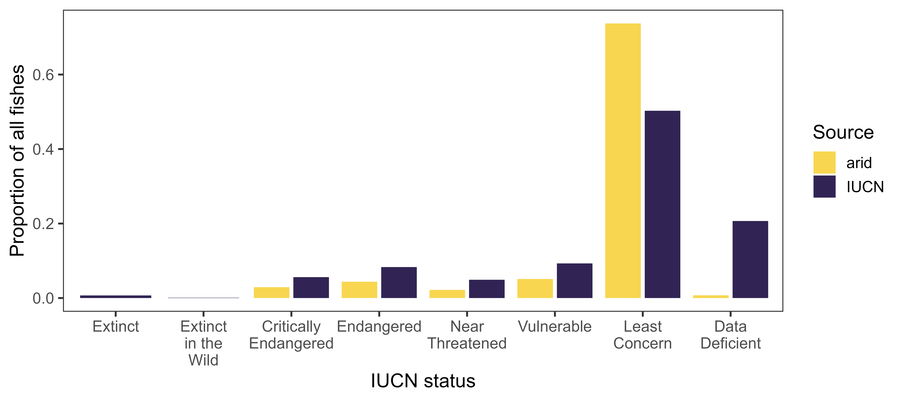

## This is the Collaborative Research on Aridland Stream Systems (CRASS) - Fish repository
### Authors
- Corey Krabbenhoft
- Marina Lauck
- Jane Rogosch
- Freya Rowland

# Metadata
- 8/25/2023 FER completed biological name verification in ISIS. Notes are stored in [Data/ITIS_name_review.xlsx](Data/ITIS_name_review.xlsx). Replaced 35 species names with updates. 19 fishes couldn't be found. So we assume they're correct I guess?
- 8/25/2023 FER fixed capitalization in fish_traits.csv. All lower case except proper nouns.
- 9/1/2023 FER cross-referenced the 19 not found with fishbase.de. Do we delete the entry for unknown fish Phoxinus belimiauensis? Do we not collapse G. nigra and others into G. robusta?
- 11/3/2023 Gila complex is split again: Katherine E. Bemis, Thomas E. Dowling, Héctor S. Espinosa-Pérez, Lloyd T. Findley, Carter R. Gilbert, Karsten E. Hartel, Robert N. Lea, Nicholas E. Mandrak, Margaret A. Neighbors, Juan J. Schmitter-Soto, and H. J. Walker, Jr. 2023. Common and Scientific Names of Fishes from the United States, Canada, and Mexico, 8th edition. https://doi.org/10.47886/9781934874691. ISBN 978-1-934874-69-1 AFS Stock 51037C, Special Publication 37
--> Reverted to original names. 

Check back later for more info as project develops

# For color schemes
- <https://www.colorhexa.com/> is helpful for finding complimentary colors
- <https://colorbrewer2.org> is an old standby
- <https://coolors.co/> is amazing

# Links to documents we're working on
- Draft manuscript: https://docs.google.com/document/d/1DLw4K51-GKcFd2ODwEpKAJwYDBpic8iqnCDerKD99Lk/edit#
- Draft figures: https://docs.google.com/presentation/d/1JrgYoNF1s1kZuVJffNZ1w5jQdHiiCk8w-bvRikgbGU4/edit?usp=sharing
- Fish traits: https://docs.google.com/spreadsheets/d/1e635zaYSAnfXS-tnaylRyoS3HWPc1yCXkABXRlYl8z0/edit?usp=sharing
- Annotated bibliogrphay: https://docs.google.com/document/d/1jXX2khXqDzatlZ5YO2RR6jawOZwgBnRI5BK9FIzbpZI/edit?usp=sharing
- Meeting notes: https://docs.google.com/document/d/1z1VCsd23RGk1SV4hZ4b2Chf414RmpXtYJorFNXoASZI/edit

# Working figures

## Comparing status of all IUCN freshwater fishes vs. our arid fish data

## [Helpful link for CART models](<https://gsp.humboldt.edu/OLM/R/05_04_CART.html#:~:text=yval%3A%20predicted%20value%20at%20the%20node%20%28yprob%29%3A%20the,next%20to%20a%20node%20indicates%20it%20is%20terminal>)

## CART model exploring the the likelihood of being a danger fish (endangered, extinct, critically endangered, extinct in the wild) based on endemism, AUS vs. USA, max length, spawning preferences, and diet

## CART model for likelihood of being a danger fish (endangered, extinct, critically endangered, extinct in the wild, threatened, vulnerable) based on endemism, AUS vs. USA, max length, spawning, and trophic level

# Notes
Need to look into [piggyback](<https://docs.ropensci.org/piggyback/>) for data file management

## How to use temperature data?
- [ ] Number of days above a certain temp?
- [ ] Length of summer (defined as > 20 C)
- [ ] Average summer temperature? Average temperature of May - September (US) and November - January (AUS)? We might need to plot of avg monthly temp in each lcation and how changes over time?
- [ ] This paper may be helpful https://aslopubs.onlinelibrary.wiley.com/doi/full/10.1002/lno.10557. 
